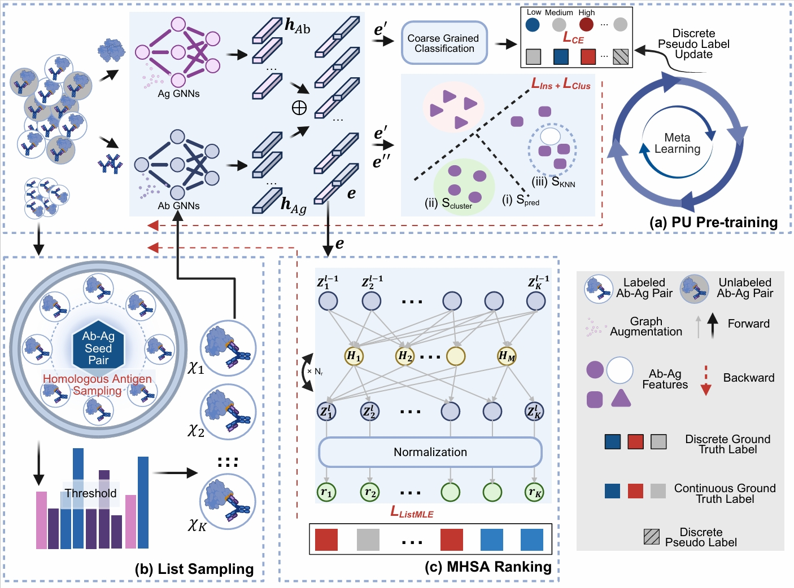

<!-- 1. Introduction =========================================================================================================== -->
# AbLWR

[](https://www.python.org/) 

## AbLWR: A Context-Aware Listwise Ranking Framework for Antibody-Antigen Binding Affinity Prediction via Positive-Unlabeled Learning
Accurate prediction of antibody-antigen binding affinity is fundamental to therapeutic design, yet remains constrained by severe label sparsity and the complexity of antigenic variations. In this paper, we propose AbLWR (Antibody-antigen binding affinity List-Wise Ranking), a novel framework that reformulates the conventional affinity regression task as a listwise ranking problem. To mitigate label sparsity, AbLWR incorporates a PU (Positive-Unlabeled) learning mechanism leveraging a dual-level contrastive objective and meta-optimized label refinement to learn robust representations. Furthermore, we address antigenic variation by employing a homologous antigen sampling strategy where Multi-Head Self-Attention (MHSA) explicitly models inter-sample relationships within training lists to capture subtle affinity nuances. Extensive experiments demonstrate that AbLWR significantly outperforms state-of-the-art baselines, improving the Precision@1 (P@1) by over 10$\%$ in randomized cross-validation experiments. Notably, case studies on Influenza and IL-33 validate its practical utility, demonstrating robust ranking consistency in distinguishing subtle viral mutations and efficiently prioritizing top-tier candidates for wet-lab screening.


<center>The overall framework of AbLWR. The architecture comprises three key components: (a) PU Pre-training: Dual GNN encoders learn robust representations from the combined dataset ($\mathcal{D}$) by jointly optimizing a composite contrastive objective ($\mathcal{L}_{\text{Ins}} + \mathcal{L}_{\text{Clus}}$) and a cross entropy loss ($\mathcal{L}_{\text{CE}}$) with meta-reweighted pseudo-labels. (b) List Sampling: A homologous sampling strategy constructs informative training lists $\mathcal{T}$ based on antigen sequence similarity ($\delta_{\text{seq}}$) and affinity margins ($y_{\text{cutoff}}$). (c) MHSA Ranking: The sampled lists are processed by MHSA mechanism to capture intra-list interactions via self-attention, yielding the final affinity ranking scores $\mathbf{r}$.</center>


<!-- 2. System =========================================================================================================== -->
# System requirements
## Hardware requirements
AbLWR package requires only a standard computer with enough RAM and a NVIDIA GPU to support operations.
## Software requirements
### OS requirements
This tool is supported for Linux. The tool has been tested on the following systems: <br>
+ Debian GNU/Linux 12 (bookworm)
### Python dependencies
`./AbLWR/env_pul.yml` describes the details of the requirements for PU Pretraining stage. <br>

`./AbLWR/env_ft.yml` describes the details of the requirements for finetunning stage.    


<!-- 3. Install guide =========================================================================================================== -->
# Install guide (training from scratch)
## Step1 - Configure the enviroment (for Conda Users).
```
git clone https://github.com/Josie-xufan/AbLWR.git 
cd ./AbLWR
```

For the PU Pretraining Stage, using the environment provided by `env_pul.yml`.

```
conda env create -f env_pul.yml
conda activate pul
```

For the Finetunning Stage, using the environment provided by `env_ft.yml`.
```
conda env create -f env_ft.yml
conda activate ablwr
```


### Step2 - Data Processing.
+ Structure prediction based on the sequence: using ESMFold for antigen and IgFold for antibody
```
python data_processing/structure_pred_antigen.py
python data_processing/structure_pred_antibody.py
```
After running these codes, the prediction structures of antibodies and antigens are located on the corresponding data path:
```
dataset/antibody_structure
dataset/antigen_structure
```

+ Graph construction: transforming the strucutres of antibody and antigen into the graph representation
```
python data_processing/graph_build_antigen.py
python data_processing/graph_build_antibody.py
```
After running these codes, the constructed graphs of antibodies and antigens are saved in the corresponding data path:
```
dataset/pairgraph/antibody
dataset/pairgraph/antigen
```


### Step3 - PU Pretraining.
```
cd pretraining 
conda activate pul
python train.py --graph_root /path/to/pairdata --fold_idx 0 --knn_aug --cont_cutoff
```
Remember to modify the arguments according to your work space. Here "/path/to/pairdata" refers to the graphs constructed by the codes above. And the pretrained weight will be located on experiment folder.

### Step4 - List Sampling.
```
cd ..
cd list_sampling
```
Then, executing the ipynb notebook to sample the Ab-Ag lists. Remember to modify the "/path/to/dataset" in the notebook based on your workspace.


### Step5 - Finetunning.
Before finetunning the model, please download the dataset collected by Liu et al. (https://github.com/biochunan/AbRank-WALLE-Affinity) and put the AbRank-all.csv dataset and the pairdata under the folder of pairgraph. Then, modify the path of:
```
self.pairdata_dir = "/path/to/pairdata"
data_registry_path = "/path/to/dataset/pairgraph/AbRank-all.csv"
```

Finally, execute the command below:
```
python finetunning/main.py --config ./finetunning/config/config.yaml
```


# Inference from the trained weight
```
python finetunning/main_test.py --pt_path ./checkpoints/2026-02-10_23-37-24_AbLWR_CV_Fold0_bs16_lr0.001_wd0.05_dr0.01_bl4_hd16_ind20/kfold_0/bestval_epoch037.pt --fold_idx 0
```


# Dataset:

Data are given in `./dataset`.

# Disclaimer
This tool is for research purpose and not approved for clinical use.

# Acknowledgements

This implementation is heavily based on the excellent work of [AbRank-WALLE-Affinity](https://github.com/biochunan/AbRank-WALLE-Affinity). We thank the authors for open-sourcing their code.

